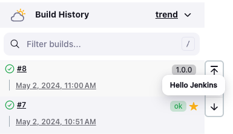

[[badge-plugin]]
= Badge Plugin
:toc: macro
:toclevels: 3
:toc-title:

image:https://ci.jenkins.io/job/Plugins/job/badge-plugin/job/master/badge/icon[Build Status,link=https://ci.jenkins.io/job/Plugins/job/badge-plugin/job/master/]
image:https://codecov.io/gh/jenkinsci/badge-plugin/branch/master/graph/badge.svg[Codecov Coverage,link=https://codecov.io/gh/jenkinsci/badge-plugin]
image:https://github.com/jenkinsci/badge-plugin/actions/workflows/jenkins-security-scan.yml/badge.svg[Jenkins Security Scan,link=https://github.com/jenkinsci/badge-plugin/actions/workflows/jenkins-security-scan.yml]

image:https://img.shields.io/jenkins/plugin/i/badge.svg?color=blue&label=installations[Installations,link=https://stats.jenkins.io/pluginversions/badge.html]
image:https://img.shields.io/github/contributors/jenkinsci/badge-plugin.svg?color=blue[Contributors,link=https://github.com/jenkinsci/badge-plugin/graphs/contributors]
image:https://img.shields.io/github/release/jenkinsci/badge-plugin.svg?label=changelog[Changelog,link=https://github.com/jenkinsci/badge-plugin/releases/latest]

== Introduction

This plugin allows users to add badges and build summary entries from a pipeline.

toc::[]

== Changelog

Since version 1.10 release notes are recorded in https://github.com/jenkinsci/badge-plugin/releases[GitHub Releases].

Changelogs for older releases can be found in the link:CHANGELOG.adoc[archive].

=== Version 2.x

Version 2.0 is a major rework of the original plugin and introduces lots of new features.
More details on this can be found in the https://github.com/jenkinsci/badge-plugin/releases/tag/badge-2.0[Release Notes for 2.0].

=== Version 1.x

Legacy version that was originally forked from the https://plugins.jenkins.io/groovy-postbuild[Groovy Postbuild Plugin].

== Usage

=== Badges

==== addBadge

This is the central pipeline step that allows user to add custom badges to their builds.
A badge can either be an icon or text that can optionally be formatted as HTML rather than plain text.
Users can also add links to the badges as well as styling to get the desired visual results.

===== Examples

See https://www.jenkins.io/doc/pipeline/steps/badge/#addbadge-add-badge[Jenkins Pipeline Steps Reference] for a detailed descriptions of the supported parameters.

[source,groovy]
----

// add a badge with an icon and text
def badge = addBadge(icon: 'symbol-rocket plugin-ionicons-api', text: 'Launching ...')

// update the icon and text during build time
badge.setIcon('symbol-planet-outline plugin-ionicons-api')
badge.setText('Lunar orbit reached, proceed landing maneuver ...')

// update the icon and text during build time
badge.setIcon('symbol-american-football-outline plugin-ionicons-api')
badge.setText('Huston, we have touchdown!')

// remove the badge
removeBadges(id: badge.getId())

// add another badge with html formatted text and css style
addBadge(text: '<i>Apollo 11 landed on the moon!</i>', style: 'color: var(--success-color)')

----

==== addInfoBadge

A convenience pipeline step that adds an `info` icon alongside a text and optional link.

===== Examples

See https://www.jenkins.io/doc/pipeline/steps/badge/#addinfobadge-add-info-badge[Jenkins Pipeline Steps Reference] for a detailed descriptions of the supported parameters.

[source,groovy]
----

// add a badge with an info icon and text
def badge = addInfoBadge(text: 'Launching in ...')

// update the text during build time
badge.setText('10 ...')
badge.setText('9 ...')
badge.setText('8 ...')

----

==== addWarningBadge

A convenience pipeline step that adds a `warning` icon alongside a text and optional link.

===== Examples

See https://www.jenkins.io/doc/pipeline/steps/badge/#addwarningbadge-add-warning-badge[Jenkins Pipeline Steps Reference] for a detailed descriptions of the supported parameters.

[source,groovy]
----

// add a badge with a warning icon, text and link
addWarningBadge(text: 'Houston, we have a problem ...', link: 'https://youtu.be/2Q_ZzBGPdqE')

----

==== addErrorBadge

A convenience pipeline step that adds an `error` icon alongside a text and optional link.

===== Examples

See https://www.jenkins.io/doc/pipeline/steps/badge/#adderrorbadge-add-error-badge[Jenkins Pipeline Steps Reference] for a detailed descriptions of the supported parameters.

[source,groovy]
----

// add a badge with an error icon and text
addErrorBadge(text: 'Transmission failed!')

----

=== Summaries

==== addSummary

This pipeline step allows users to add custom summaries to their build overview.
A summary can consist of an icon and text that can optionally be formatted as HTML rather than plain text.
Users can also add links to the summary as well as styling to get the desired visual results.

===== Examples

See https://www.jenkins.io/doc/pipeline/steps/badge/#addsummary-add-summary[Jenkins Pipeline Steps Reference] for a detailed descriptions of the supported parameters.

[source,groovy]
----

// add a summary with an icon, text and link
addSummary(icon: 'symbol-home-outline plugin-ionicons-api', text: 'Test Chamber prepared', link: 'https://jenkins.io')

// add another summary with an icon and text
def summary = addSummary(icon: 'symbol-people-outline plugin-ionicons-api', text: 'Looking for Test Subjects ...')

// removes a summary
removeSummaries(id: summary.getId())

// add another summary with an icon and formatted html as text
addSummary(icon: 'symbol-aperture-outline plugin-ionicons-api',
           text: '<b>Results:</b><li>Test Chamber ready</li><li>Test Subject missing</li>')

----

=== Allow HTML in Badges and Summaries

The Badge Plugin uses Jenkins Markup Formatter to sanitize HTML in badges and summaries.
This ensures safety when using HTML for texts and prevents malicious injections.

